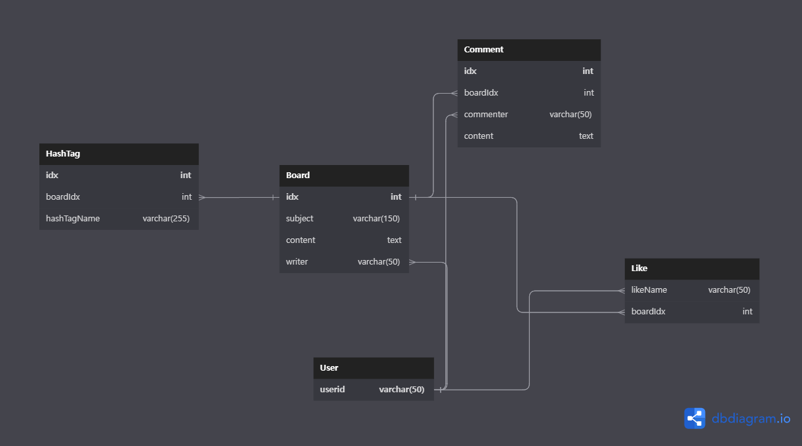

TableName.bulkCreate = add to value in Table

`sql/sequelize.sql`
Create() - data 생성
Update() - data 업데이트
destroy() - data 삭제
findAll() - 데이터 검색
findByPk - 특정 Primary Key mehod



**board.models.js**

```js
Board.belongsTo(User, { foreignKey: "writer" });
```

foreignKey: 설정할 자식의 필드명

**board.models.js**

```js
 writer: {
            type: Sequelize.STRING(50),
            allowNull: false,
            references: {
              model: "User",
              key: "userId",
            },
            onUpdate: "cascade",
            onDelete: "cascade",
          },
```

references : 참조할 부모 테이블, 필드명

onDelete :

- restrict: 부모 테이블을 삭제시 관련된 모든 데이터의 삭제를 거부한다.
- cascade : 부모 테이블을 삭제시 관련된 모든 데이터가 삭제된다.
- set null : 부모 테이블을 삭제시 관련된 모든 데이터를 Null로 만든다.
- no action : 아무것도 하지 않는다. (기본값)
  onUpdate :
- restrict: 부모 테이블을 수정시 관련된 모든 데이터의 수정을 거부한다.
- cascade : 부모 테이블을 수정시 관련된 모든 데이터가 수정된다.
- set null : 부모 테이블을 수정시 관련된 모든 데이터를 Null로 만든다.
- no action : 아무것도 하지 않는다. (기본값)

'RESTRICT': 관렵값의 업데이트를 거부?
'CASCADE': 관련값 다 자동 업데이트
'SET NULL': 관련값 다 Null로
'NO ACTION': 암것도 안함
.
The available options for OnDelete are:
'RESTRICT': 관련값의 삭제를 거부
'CASCADE': 관련값 다 삭제
'SET NULL': 관련값 전부 Null로 바꿈
'NO ACTION': 암것도 안함
